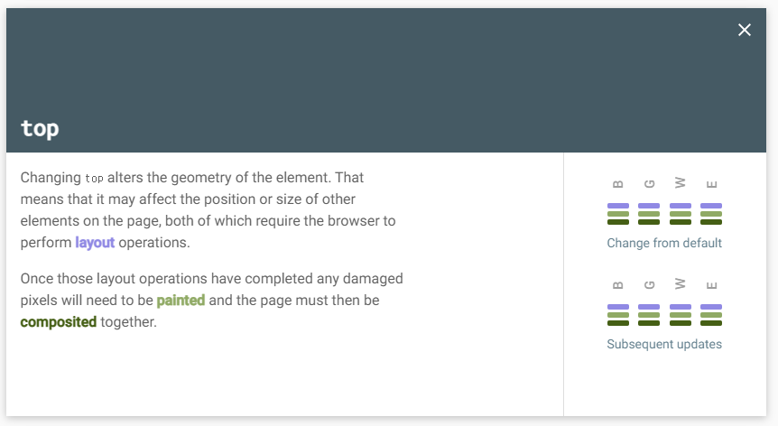
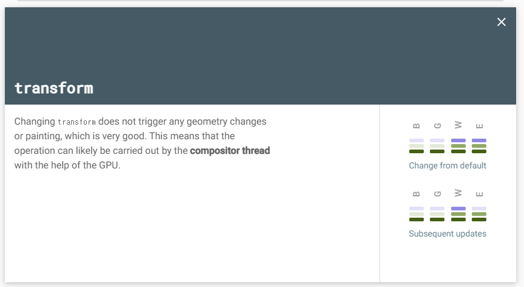
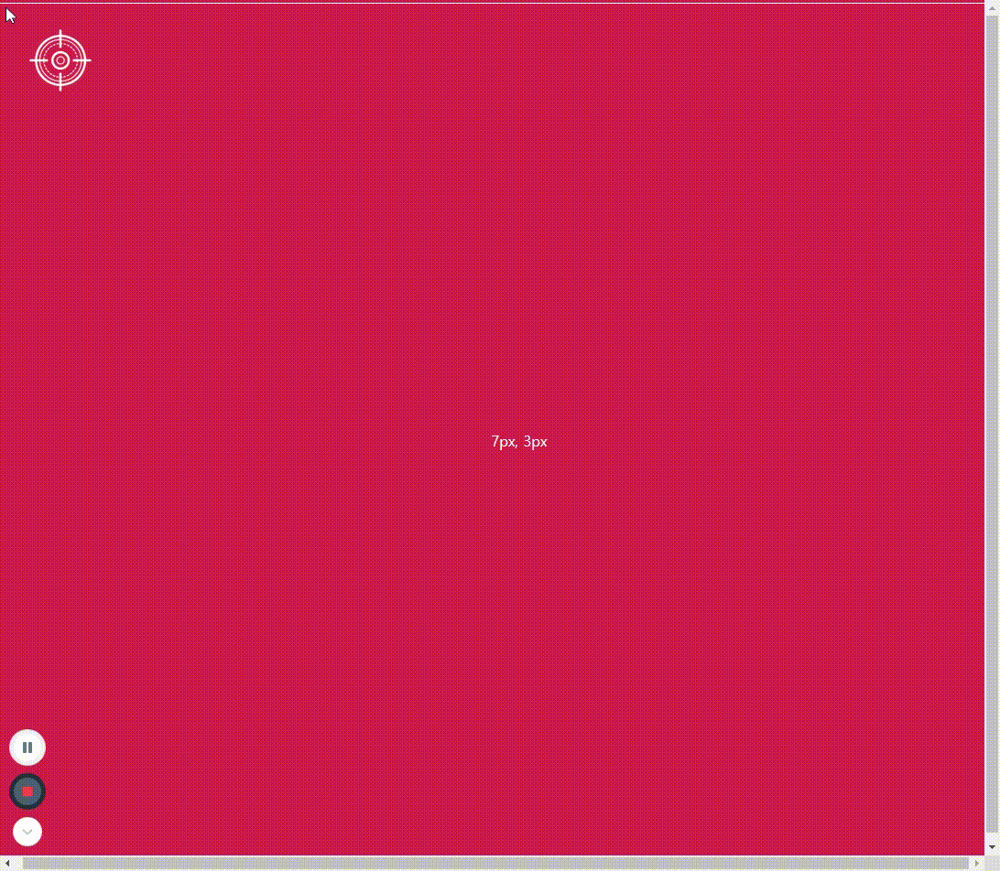

# Let's upgrade performances!

DOM, CSSOM, RENDER Tree를 배웠다.

성능을 업그레이드 해보자.

<br/>
<br/>

# 좌표 연결을 변경하자

## Before

```jsx
vertical.style.left = `${x}px`;
horizontal.style.top = `${y}px`;
```

## After

```jsx
vertical.style.transform = `translateX(${x}px)`;
horizontal.style.transform = `translateY(${y}px)`;
```

<br/>

기존에는 left와 top의 좌표를 직접 변경했지만 이는 layout단계부터 바꾸기 때문에 성능이 매우 떨어진다.

transform은 composition만 변경하니까 성능이 좋아진다. 그러므로 trasform을 이용해서 x, y의 좌표를 변경해준다.

기존에 css에 세팅해놓은 top, left는 이제 필요없으니 지우자.

처음에 top, left를 설정해 준 이유가 첫 로딩화면에서 예쁘게 보이려고 세팅해놓은건가?

css에 해당 값을 지정해놓지 않아도 움직임은 잘 일어난다.

<br/>

* top과 transform 속성의 성능비교




<br/>
<br/>
<br/>

# target을 정중앙으로 옮기자

## Before

```jsx
//CSS

.target {
  position: absolute;
  top: 50%;
  left: 50%;
  /* img가 크로스선 중앙으로 오도록 조정
  translate(move to left, move to top) */
  transform: translate(-50%, -50%);

//JS
target.style.left = `${x}px`;
target.style.top = `${y}px`;
```

## After

```jsx
//CSS
.target {
  position: absolute;
}

//JS
const targetRect = target.getBoundingClientRect();
const targetHalfWidth = targetRect.width / 2;
const targetHalfHeight = targetRect.height / 2;

target.style.transform = `translate(${x - targetHalfWidth}px, ${y - targetHalfHeight}px)`;
```

<br/>

이미지를 크로스선 정 중앙으로 맞추기 위해서 기존에는 CSS에서 transform으로 좌표위치를 조정해줬지만, 그렇게 하면 아래처럼 움직일 때마다 움직이는 좌표로 부터 -50%씩 떨어지면서 움직이게 되버린다. 

<br/>



<br/>

그래서 지금은 transform으로 좌표를 유동적으로 변경하기 때문에 변경하는 좌표에다가 직접 이미지 위치를 조정해줘야 한다.

위치는 이미지의 절반만큼 조정해 주면 되기 때문에  "getBoundingClientRect"를 이용해 target의 가로, 세로 길이를 불러와 절반으로 나눠준다.

이전에 해당 코드 작성 시, 직접 좌표조정값을 숫자로 쓰지 않고 어떻게 하면 변수로 들여올 수 있을까?가 궁금했는데 이렇게 이미지크기에 따른 절반값을 변수로 가져오면 어떤 이미지크기든 상관없이 항상 크로스라인 정중앙에 위치할 수 있게 되니 굳!


<br/>
<br/>

### 참고사이트

[https://csstriggers.com](https://csstriggers.com)

<br/>
