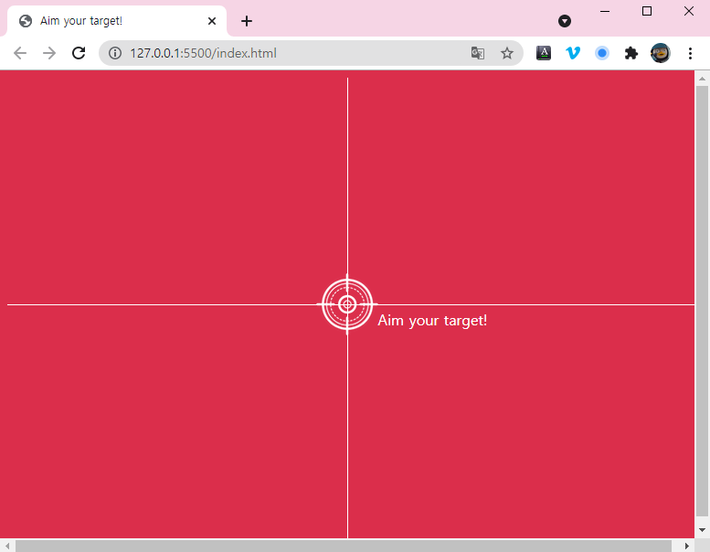

<br/>

# CSS: 원하는 그림 그리기

## 🏃🏾‍♀️실행화면



브라우저 중앙에 각 선과 타켓이 위치하도록 만들었다. 아직 움직이지는 않고 마치 사진을 찍은 것 처럼 고정되어있을 뿐이다.

<br/>
<br/>
<br/>

## 🏃🏾‍♀️실행코드

```jsx
/* CSS로 그림그리기 */

body {
  background-color: #db2e4b;
}

.line {
  position: absolute;
  background-color: white;
}

.horizontal {
  position: absolute;
  /* 가로선을 그려야 하니, 가로는 100%를 주고, 세로는 선이니까 얇게 1px로 줄임 */
  width: 100%;
  height: 1px;
  /* 위에서 50% 떨어진 곳에 위치 */
  top: 50%;
}

.vertical {
  position: absolute;
  height: 100%;
  width: 1px;
  /* 왼쪽에서 50% 떨어진 곳에 위치 */
  left: 50%;
}

.target {
  position: absolute;
  top: 50%;
  left: 50%;
  /* img가 크로스선 중앙으로 오도록 조정
  translate(move to left, move to top) */
  transform: translate(-50%, -50%);
}

.coordinator {
  color: white;
  position: absolute;
  top: 50%;
  left: 50%;
  transform: translate(28%, 30%);
}
```

위에서 세팅해놓은 4가지 요소를 내가 원하는 모양과 위치에 나타내도록 한다.

<br/>
<br/>

  ### ✔️선을 그리자

```jsx
.horizontal {
  position: absolute;
  /* 가로선을 그려야 하니, 가로는 100%를 주고, 세로는 선이니까 얇게 1px로 줄임 */
  width: 100%;
  height: 1px;
}

```

선을 그릴 때, 처음에 큰 박스를 먼저 만들고 그 박스를 선으로 바꾼다고 생각하면 될 것 같다.

그래서 수평선(horizontal)은 가로로는 화면 전체를 차지하게 되니 100%로 두고

세로로는 얇게 표시만 되면 되니 원하는 픽셀만큼의 크기를 지정해주면 된다.

<br/>
<br/>

  ### ✔️원하는 곳에 위치시키자

```jsx
.horizontal {
  position: absolute;
  /* 가로선을 그려야 하니, 가로는 100%를 주고, 세로는 선이니까 얇게 1px로 줄임 */
  width: 100%;
  height: 1px;

  /* 위에서 50% 떨어진 곳에 위치 */
  top: 50%;
}
```

선을 그리고 원하는 곳에 해당 물체를 위치시키위 위해서 top, left를 사용한다.

브라우저 창 왼쪽 상단 모서리를 시작으로 해서 가로로는 left, 세로로는 top을 사용한다.

즉, (x, y) → (left, top)이라고 생각하면 된다.

<br/>
<br/>
<br/>

## 🤔 궁금증

근데 어차피 동적으로 만들면 꼭 저렇게 가운데 위치시키지 않아도 움직이게되면 결국 가운데로 오도록 되는거 오는거 아닌가? 왜 굳이 초기값을 저렇게 가운데에 위치하도록 세팅하는거지?

그건 바로, 처음 보여질 때에 보이는 화면의 구성을 위한 것!

<br/>
<br/>
