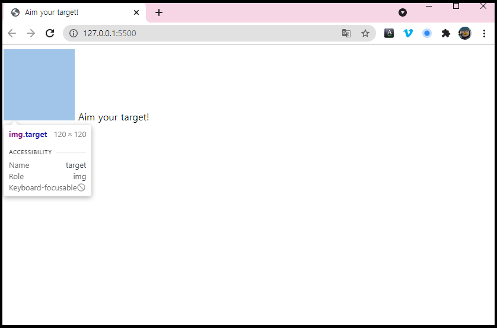

<br/>

# HTML: 필요한 요소 만들기
<br/>

## 🏃🏾‍♀️실행화면



아직 작성된 것이 내용밖에 없어서 글자와 이미지밖에 안 보인다.  이미지가 흰색인데 바탕화면이 흰색이어서 안보이지만<br/>
개발자모드로 확인해보면 target이라는 이미지가 들어가 있는 것을 확인해 볼 수 있다.

<br/>
<br/>
<br/>

## 🏃🏾‍♀️실행코드

```jsx
<body>
  <!-- 구현하고싶은 요소 4가지 추가 -->

  <div class="line horizontal"></div>
  <div class="line vertical"></div>
  
  <span class="coordinator">Aim your target!</span>

  <!-- coordinator에는 맨 처음 실행 시 보여지는 문구를 넣었다. -->
</body>
```

브라우저 상에 표현하고 싶은 요소들을 넣는다.

현재는 수평선, 수직선, 타켓그림, 좌표의 4가지 요소를 보여주고 싶으니 4가지 요소를 각각 HTML TAG로 작성한다.

<br/>
<br/>
<br/>

## ❗주의사항

```jsx
<head>
  ...
  <!-- js와 css를 연결시켜줘야함 -->
  <script src="main.js" defer></script>
  <link rel="stylesheet" href="style.css">
  <title>Aim your target!</title>
</head>
```

제대로 다 적은 것 같은데 화면에 css가 구동이 안돼서 대체 왜 안될까?

찾아보니 head에 js와 css를 연결해주는 코드를 넣어야 한다.

아, 어쩐지..

내가 js 코드창을 여러개 띄어놔도 어떻게 html이 내가 현재 작성하고 있는 js 코드창이 뭔지 알고 연결시켜서 화면에 보여주지?<br/>
라는 생각을 했는데 역시, 이런 연결코드가 존재했다.

참 코드는 직관적이고 정직한 것 같다.

<br/>
<br/>
<br/>
