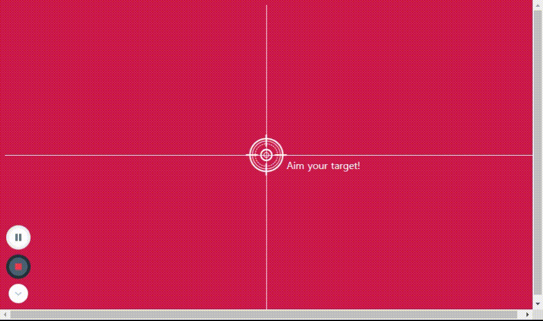

<br/>

# JS: 그림을 동적으로 만들기

<br/>

## 🏃🏾‍♀️실행화면



<br/>
<br/>
<br/>

## 🏃🏾‍♀️실행코드

```jsx
//불러올 때 .(class)을 찍어야함!
const horizontal = document.querySelector(".horizontal");
const vertical = document.querySelector(".vertical");
const target = document.querySelector(".target");
const coordinator = document.querySelector(".coordinator");

//움직이도록 만들자
document.addEventListener("mousemove", mouseMove)

function mouseMove(event) {
  const x = event.clientX
  const y = event.clientY
  console.log(`${x}, ${y}`);

  //수평선에 연결, 수직으로 움직여야하니까 top, y좌표 연결
  // '좌표'에 연결해줘야하니까 그냥 y가 아니라 좌표로 입력해줄것!
  horizontal.style.top = `${y}px`;
  vertical.style.left = `${x}px`;

  //이미지연결
  target.style.left = `${x}px`;
  target.style.top = `${y}px`;

  //좌표연결
  coordinator.style.left = `${x}px`;
  coordinator.style.top = `${y}px`;

  //좌표표시
  coordinator.innerHTML = `${x}px, ${y}px`;
}
```

이 파트는 HTML/CSS 와 JS를 연결시키는 코드가 들어가서 처음엔 조금 헷갈렸는데 지금은 어떤 원리로 작동되는지 대략 이해되는 것 같다.

<br/>
<br/>

### ✔️마우스 포인터를 따라 움직이게 해보자

```jsx
function mouseMove(event) {
  const x = event.clientX
  const y = event.clientY
  console.log(`${x}, ${y}`);

  //수평선에 연결, 수직으로 움직여야하니까 top, y좌표 연결
  // '좌표'에 연결해줘야하니까 그냥 y가 아니라 좌표로 입력해줄것!
  horizontal.style.top = `${y}px`;
  vertical.style.left = `${x}px`;
```

마우스가 움직이는 이벤트를 불러와서 브라우저 상의 좌표를 표시하는 client에 연결시켜준다.

앞에서 말했듯이 left는 x, top은 y와 같으므로 움직이고 싶은 방향의 좌표를 연결시켜주면 된다.

<br/>
<br/>
<br/>

## 🤔 궁금증

찾아보니 querySelector와 getElementbyId 두가지 방법을 사용하던데 차이가 뭘까?

(내가 찾아봤을 때엔 주로 getElementby방법을 많이 사용하고있었다.) 

두 방법의 요약하면 다음과 같다.

- 구체적인 요소를 선택하고 싶다면? querySelector
- 빠르고 지원이 더 좋은 것은? getElementby

근데 내가 getElementby로 불러왔을 때, style.left가 적용되지 않았다. 해당 방법을 사용하면 style을 불러오는 방법이 다른 것일까? 

공부해서 추가하자.
